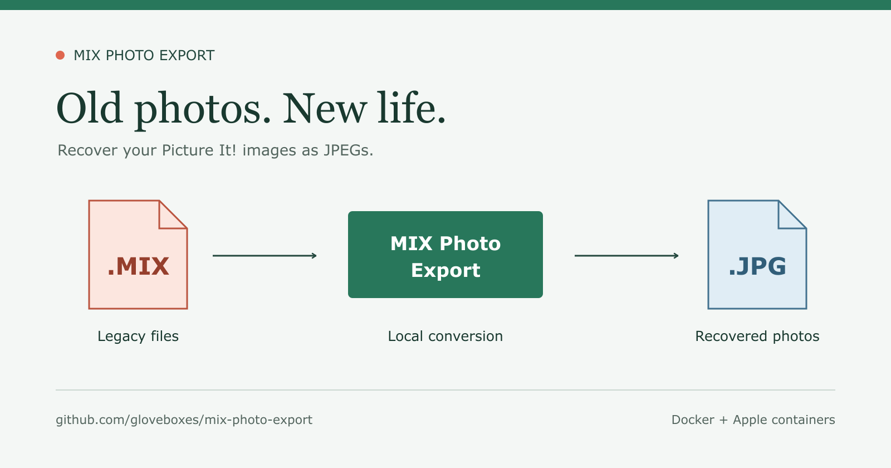

# Rescue Your Old Picture It! Photos: Convert .MIX Files to JPEG

*A small tool for bringing photos out of a legacy format and back into your photo library.*



An old backup drive can hold more than forgotten documents. It might contain
family holidays, birthdays, or photos you thought were lost. Then you notice
the file extension: `.mix`. Your current photo app cannot open it.

If those files came from **Microsoft Picture It!**, MIX Photo Export can help.
It is a small tool for recovering the images inside those documents and
exporting them as JPEGs, a format today's photo apps understand.

## Recover the Photo, Not Just the Thumbnail

A Picture It! MIX file can contain several embedded images, not simply one
ordinary photo with an unusual filename. Renaming it to `.jpg` will not convert
it.

MIX Photo Export decodes each recognized image at its **highest stored
resolution**. When a document contains multiple image stores, it exports them
separately. Standalone FlashPix `.fpx` images are supported too.

JPEG quality defaults to **100**, although JPEG is still lossy at that setting.
The tool cannot add detail that was never present in the original file.

## Keep Your Originals

The container launcher mounts your input folder read-only, and the decoder
works on temporary copies. Your exports go into a separate folder. Existing
JPEGs are skipped rather than overwritten.

That makes it practical to work through an old archive without replacing the
files you are trying to preserve. Keep a backup of those originals anyway:
JPEG exports are useful copies, not substitutes for editable documents.

## Try It on a Folder

Install and start Docker, then clone the project and build its image:

```sh
git clone https://github.com/gloveboxes/mix-photo-export.git
cd mix-photo-export
docker build -t mix-photo-export:local .
```

On macOS or Linux, convert a folder with:

```sh
bash scripts/mix-photo-export --runtime docker convert \
  "/path/to/mix photos" "/path/to/recovered photos"
```

The first build downloads its container base and system packages. Conversion
runs locally with networking disabled; your photos are not uploaded.

Docker also provides the Windows route, with PowerShell instructions in the
project README. Apple Silicon users can use Apple's container runtime instead
of Docker. Neither container route requires a host compiler or photo-decoding
libraries.

## A Legacy Library, Kept With the Project

The decoder uses ImageMagick's maintained version of the FlashPix toolkit,
originally developed by Digital Imaging Group and Eastman Kodak. An exact
source revision is included in the repository, along with its licensing
notices, rather than downloaded from upstream during compilation.

That protects against the library's source disappearing. It does not promise
permanent compatibility or remove the need for security maintenance.

## Know What You Are Recovering

This is **photo recovery, not Picture It! document reconstruction**. Text,
page layouts, layer positioning, and viewing adjustments are not reproduced.
Metadata and ICC profiles are not copied. Folder scanning is nonrecursive,
and unrelated formats that also use `.mix` are not supported.

Start with a few files and inspect the results. For an archive of inaccessible
Picture It! photos, getting the embedded images back into an everyday format
can be the useful first step.

**Project and instructions:** https://github.com/gloveboxes/mix-photo-export